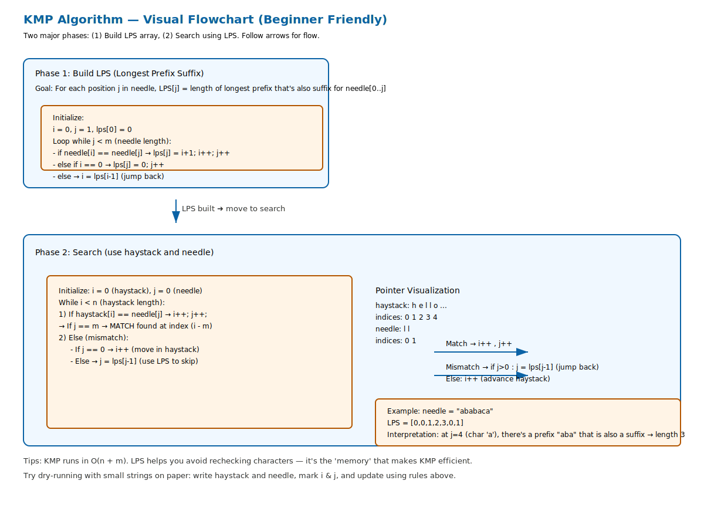

# 🔍 KMP Algorithm – String Matching (`strStr` Implementation)

The **Knuth–Morris–Pratt (KMP) Algorithm** is a smart way to find a substring (`needle`) inside another string (`haystack`).
Unlike brute force (which may re-check the same characters many times), KMP **remembers past matches** using an **LPS array** (Longest Prefix Suffix).

---

## 🧠 Why Not Brute Force?

Imagine searching `"ll"` in `"hello"`:

```
hello
  ll   ← checking from index 2
```

In brute force, if a mismatch happens, you often go back and recheck characters you already matched.
👉 That’s wasted work.

KMP avoids this by using **LPS**.

---

## 📌 Step 1: Build the LPS Array

**LPS (Longest Prefix Suffix)** tells us:
👉 “If a mismatch happens, how far can we safely shift the pattern without losing progress?”

Example: `needle = "ababaca"`

| Index (j) | Pattern char | LPS\[j] | Meaning          |
| --------- | ------------ | ------- | ---------------- |
| 0         | a            | 0       | no prefix=suffix |
| 1         | b            | 0       | no prefix=suffix |
| 2         | a            | 1       | "a" matches      |
| 3         | b            | 2       | "ab" matches     |
| 4         | a            | 3       | "aba" matches    |
| 5         | c            | 0       | reset            |
| 6         | a            | 1       | "a" matches      |

So `LPS = [0,0,1,2,3,0,1]`

---

## 📌 Step 2: Search Using LPS

We use two pointers:

* `i` → position in **haystack**
* `j` → position in **needle**

Algorithm:

1. Compare `haystack[i]` and `needle[j]`.
2. If they match → move both forward.
3. If mismatch:

   * If `j > 0` → don’t restart from `0`, just shift `j = lps[j-1]`.
   * Else → move `i` forward.
4. If `j == needle.length` → pattern found at index `(i - j)`.

---

## 🖼️ Visual Walkthrough

Example: `haystack = "hello"`, `needle = "ll"`

```
haystack:  h e l l o
needle:          l l
```

* Compare `h` vs `l` → mismatch → shift
* Compare `e` vs `l` → mismatch → shift
* Compare `l` vs `l` → ✅ match → move i,j
* Compare next `l` vs `l` → ✅ match → j == length → found at index 2

---

## ✅ JavaScript Implementation

```js
var strStr = function (haystack, needle) {
    let n = haystack.length;
    let m = needle.length;

    if (m === 0) return 0; // Edge case

    // Step 1: Build LPS
    let lps = new Array(m).fill(0);
    let i = 0, j = 1;

    while (j < m) {
        if (needle[i] === needle[j]) {
            lps[j] = i + 1;
            i++; j++;
        } else {
            if (i === 0) {
                lps[j] = 0;
                j++;
            } else {
                i = lps[i - 1];
            }
        }
    }

    // Step 2: Search
    i = 0; j = 0;
    while (i < n) {
        if (haystack[i] === needle[j]) {
            i++; j++;
            if (j === m) return i - m;
        } else {
            if (j === 0) {
                i++;
            } else {
                j = lps[j - 1];
            }
        }
    }

    return -1;
};
```

---

## 🕹️ Example Runs

```js
console.log(strStr("hello", "ll"));   // 2
console.log(strStr("aaaaa", "bba")); // -1
console.log(strStr("abc", ""));      // 0
```

---

# 🔍 KMP Algorithm – Visual Explanation

## 📖 Flowchart
The algorithm has two main phases: **LPS building** and **searching**.  



---

## ⚡ Why KMP is Better?

* **Brute Force:** O(n × m)
* **KMP:** O(n + m)

👉 Much faster for large strings!

---

## 🌟 Key Idea for Beginners

* LPS = a **cheat sheet** that tells you “how much of the pattern we can keep” after mismatch.
* KMP = smart matching using that cheat sheet.

---
